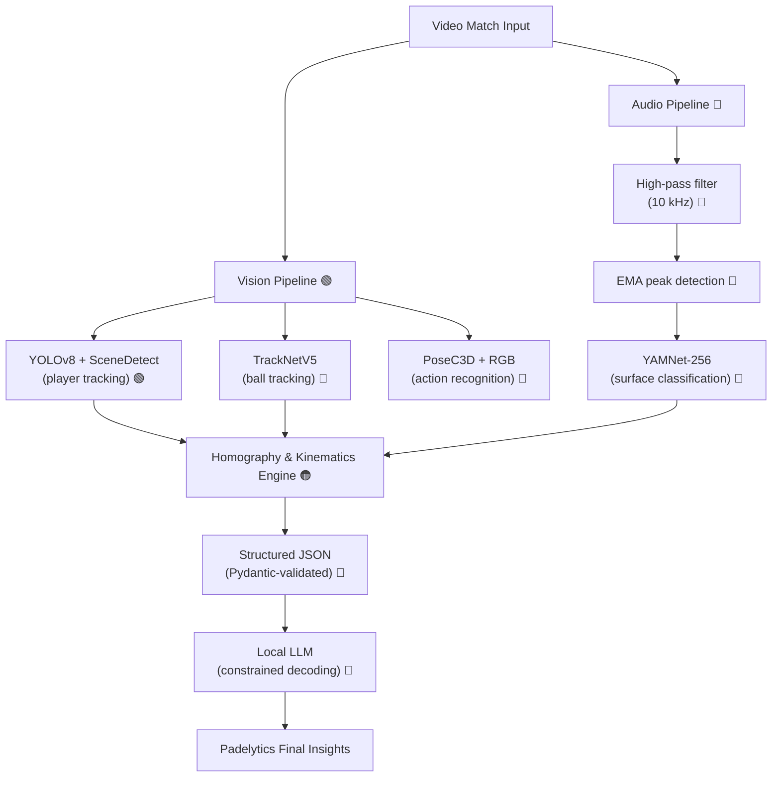

<p align="center">
  <h1 align="center">Padelytics & BandejAI</h1>
  <p align="center"><strong>Open-source, single-camera tactical & statistical analysis for padel</strong></p>
  <p align="center">
    <a href="https://github.com/Moloshow/BandejAI/actions"></a>
    <a href="https://github.com/Moloshow/BandejAI"></a>
    <a href="https://github.com/Moloshow/BandejAI"></a>
    <a href="https://github.com/Moloshow/BandejAI/blob/main/LICENSE"></a>
    <a href="https://github.com/Moloshow/BandejAI/issues"></a>
  </p>
</p>

> **Status: Alpha.** The core 2D Player Tracking and Homography pipeline is fully implemented. Ball tracking and advanced features are currently under development.

---

## Overview

**Padelytics** is an open-source ecosystem dedicated to tactical and statistical analysis of padel. Its core AI engine, **BandejAI**, extracts advanced metrics from a **single monocular video recording** and turns them into actionable coaching insights.

The MVP runs entirely **offline** (asynchronous batch processing of video files). A multimodal pipeline fuses **computer vision**, **acoustic analysis**, and **local large language models** to deliver deep tactical insights and an automated "Virtual Coach".

---

## System Architecture

BandejAI separates concerns across **three isolated layers**: extraction (deep learning), deterministic geometry/kinematics, and semantic reasoning (multimodal LLM).



---

## Core Features

> 🟢 **Fully Implemented** | 🟠 **Work In Progress** | 🔴 **Pending / Planned**

### 1. Computer Vision & Deep Learning
- 🟢 **Scene Detection** - Automated extraction of actual gameplay rallies from full broadcast matches using `PySceneDetect`, filtering out dead time.
- 🟢 **Player tracking** - Bounding-box detection with YOLOv8 paired with ByteTrack. Includes a custom `PlayerMerger` that locks identities to specific court sides, and a `TrajectorySmoother` (Pandas-based) that interpolates missing detections when players are occluded by the back court glass/mesh.
- 🔴 **Ball tracking** - Spatio-temporal detection using **TrackNetV5**, which ingests a 3-frame sliding window and predicts Gaussian heatmaps instead of bounding boxes. This is critical for surviving motion blur and complex glass/mesh backgrounds.
- 🔴 **Action recognition** - Fine-grained stroke classification (*Bandeja*, *Vibora*, *Chiquita*) using a **PoseC3D** network enhanced with **RGB Early-Fusion**, capturing both body kinematics and racket-head angles that pure skeleton graphs (ST-GCN) miss.

### 2. Geometry & Kinematics (deterministic)
- 🟢 **Homography projection** - Transform image coordinates `(u, v)` to 2D court-space `(x, y)` via a perspective matrix computed from an interactive 12-point calibration UI. It automatically rejects replays and zoom-in shots by detecting geometric mismatches.
- 🟢 **HD Broadcast Dashboard** - Automatic side-by-side rendering of the HD video feed and a perfectly scaled 2D minimap with trajectory projections.
- 🔴 **Ball kinematics** - Velocity estimation from projected positions, smoothed by a **Kalman filter** to mitigate tracking jitter and interpolate micro-occlusions.
- 🔴 **The "Corde"** - Euclidean distance between partners over time, a key tactical indicator of defensive/offensive synchronization. Time-series analysis of this distance quantifies transition discipline (synchronized net approaches).

### 3. Multimodal Analysis & Generative Coaching
- 🔴 **Acoustic refereeing** - Millisecond-accurate bounce detection using a high-pass Butterworth filter (10 kHz, zero-phase) and EMA energy thresholding. Surface classification (glass vs. turf vs. racket) is handled by a fine-tuned **YAMNet-256** micro-CNN fed 50 ms Mel-spectrograms around each peak - far more reliable than raw YAMNet's 960 ms windows for impulsive 1-5 ms events.
- 🔴 **Virtual Coach** - 2D game events are translated into structured JSON and processed by a **local LLM** (e.g., Hermes 2 Pro / Qwen-JSON, 7-8B) with **constrained decoding** (Pydantic / JSON Schema), making syntactically invalid output mathematically impossible. Raw geometry is pre-translated into semantic spatial concepts ("transition zone", "net", "back court") before prompting, so the LLM reasons on interpretable context.

---

## Key Technical Decisions

| Domain | Choice | Rationale |
|---|---|---|
| Pipeline Orchestration | **3-Pass Offline Batching** | Enables retrospective trajectory smoothing and geometric validation that is mathematically impossible in real-time. |
| Ball detection | **TrackNetV5** (heatmaps, 3-frame window) | Survives motion blur & glass/mesh backgrounds where YOLO fails |
| Stroke classification | **PoseC3D + RGB Early-Fusion** | Skeleton heatmaps capture biomechanics; RGB adds racket angle/effect - essential to separate *Bandeja* vs *Vibora* |
| Pose estimation | **ViTPose-L** | Vision-Transformer based; superior to convolutional pose estimators on PadelTracker100 |
| Court projection | **Homography (OpenCV)** + planar assumption | Deterministic, explainable; replays automatically rejected. |
| Acoustic events | **2-stage: EMA peak + YAMNet-256** | Ball impacts are 1-5 ms; raw YAMNet's 960 ms window drowns the signal |
| Tactical reports | **Local LLM + constrained decoding** | No regex parsing; Pydantic schema enforced at the token-distribution level |
| Transfer learning | **FineBadminton -> Padel** | *Slice smash* biomechanics (decentered hit, wrist whip) share latent structure with *Vibora* |

---

## Project Structure

```text
BandejAI/
├── vision/                         # Image processing & visual neural networks
│   ├── pipeline.py                 # Core 3-pass tracking orchestrator
│   ├── visualization.py            # Dashboard rendering & 2D Mini-Map
│   ├── scene_detection/            # PySceneDetect wrapper for rally extraction
│   ├── player_tracking/            # YOLOv8 + ByteTrack + Trajectory Smoothing
│   ├── ball_tracking/              # TrackNetV5 detection [TODO]
│   └── action_recognition/         # PoseC3D + RGB Early-Fusion [TODO]
│
├── core_math/                      # Deterministic geometry & kinematics
│   ├── homography/                 # H matrix computation & 2D projection
│   │   ├── projector.py            # Coordinate transformations
│   │   └── calibration_ui.py       # Interactive 12-point mapping interface
│   └── kinematics/                 # Ball trajectory & the "Corde" [TODO]
│
├── audio/                          # Acoustic signal analysis & refereeing [TODO]
├── llm_coach/                      # Tactical report generation via local LLM [TODO]
│
├── examples/                       # API usage snippets & standalone tutorials
│   ├── api_tracking_example.py     # Minimal script to use the PlayerTracker natively
│   └── demo_scene_detection.py     # Test utility for rally extraction
│
├── main.py                         # Offline orchestrator (CLI)
├── requirements.txt                # Python dependencies
└── README.md
```

---

## Installation

### Prerequisites
- **Python 3.10+**
- **CUDA-compatible GPU** strongly recommended (inference of YOLOv8 + TrackNet + PoseC3D on CPU is impractical for full matches)
- **ffmpeg** (audio extraction)

### Setup

> **Recommended: use a dedicated Conda environment.**
> PyTorch with CUDA must be installed first, from its official index,
> otherwise pip will pull the CPU-only build.

```bash
# 1. Clone
git clone https://github.com/Moloshow/BandejAI.git
cd BandejAI

# 2. Create & activate the Conda environment
conda create -n bandejai python=3.10 -y
conda activate bandejai

# 3. Install PyTorch with CUDA (adjust cu121 -> your CUDA version)
pip install torch torchvision --index-url https://download.pytorch.org/whl/cu121

# 4. Install runtime + dev dependencies
pip install -r requirements.txt
pip install -r requirements-dev.txt

# 5. Configure environment
copy .env.example .env   # Windows
# cp .env.example .env   # macOS / Linux
```

### Verify the installation

```bash
python -c "import torch; print('CUDA:', torch.cuda.is_available())"
pytest                  # should pass (fast unit tests only)
ruff check .            # should report no issues
```

> Model weights (YOLOv8, TrackNetV5, ViTPose, PoseC3D, YAMNet-256) are not bundled. A download script will be provided in a future release. For now, follow the per-module instructions in `vision/`, `audio/`, and `llm_coach/`.

---

## Quickstart

Run the offline analysis pipeline on a recorded match. You can provide a raw video, or pass a YAML configuration file to bypass the manual calibration and skip the automatic scene detection.

```bash
# Option 1: Full automated pipeline (Prompts for Homography Calibration UI)
python main.py --video_path path/to/match.mp4 --output_dir outputs/v1/

# Option 2: Using a pre-cached configuration (Fastest)
python main.py --config data/sample_match_config.yaml --output_dir outputs/v1/
```

The orchestrator will, in sequence:
1. Detect rallies automatically using `PySceneDetect` (unless cached in config).
2. Prompt for **12 court keypoints** for Homography (unless cached in config).
3. Track players using YOLOv8 (1088p) and map them to the 2D court.
4. Smooth trajectories and merge players to stable court slots.
5. Export a high-quality MP4 Broadcast Dashboard for each rally.

### Using Configuration Files (YAML)

To speed up repeated testing on the same video, you can cache the geometry and timestamps in a `.yaml` file. This bypasses both the manual UI calibration and the `PySceneDetect` processing time.

```yaml
video_path: "data/sample_match.mp4"
points_mode: 12

# 1. To get these points, run main.py once WITHOUT config.
# The UI will prompt you to click the 12 court intersections.
# Once calibrated, copy the `[[x, y], ...]` array printed in your console.
image_points:
  - [347.0, 715.0]
  - [1573.0, 715.0]
  # ...

# 2. To get rally timestamps, run: 
# python examples/demo_scene_detection.py --video your_video.mp4
# Then copy the frame intervals [start_frame, end_frame] printed in the summary.
rallies:
  - [0, 338]
  - [475, 1152]
```

### API Examples

If you want to use the underlying classes programmatically, check the `examples/` directory:
```bash
# Minimal PlayerTracker example (No UI)
python examples/api_tracking_example.py

# Standalone Scene Detection testing
python examples/demo_scene_detection.py --video data/sample_match.mp4.webm
```

---

## Roadmap (MVP)

| Phase | Goal | Status | Key Dependencies / Risks |
|---|---|:---:|---|
| **1. Spatial core & player tracking** | 2D positions, automated rally extraction, UI dashboard | 🟢 **Done** | Core pipeline established and stable |
| **2. Ball kinematic extraction** | Trajectory, speeds, parabola modeling | 🔴 **Next up** | TrackNet must be trained/adapted to padel glass & mesh; VRAM-intensive alongside YOLO |
| **3. Acoustic refereeing** | ms-accurate bounce detection, surface classification | 🔴 **Planned** | Strict audio-video timestamp alignment required to trigger ball homography |
| **4. Advanced action recognition** | *Bandeja*, *Vibora*, *Chiquita* classification | 🔴 **Planned** | Needs a transfer-learned mini-dataset from badminton foundations (FineBadminton) |
| **5. Semantic analysis & LLM Coach** | Automated tactical feedback, highlight segmentation | 🔴 **Planned** | Output quality depends on the geometry-semantics translation before LLM prompting |

---

## Contributing

TBD

---

## License

Licensed under the **Apache License, Version 2.0** - see [LICENSE](LICENSE).

---

## Acknowledgements & References

**BandejAI** is a custom-engineered ecosystem built from the ground up. However, state-of-the-art computer vision is a collaborative effort, and our architectural design draws inspiration from several foundational open-source works, research papers, and datasets.

### Reference repositories
- **[DS_Padel](https://github.com/AlvaroNovillo/DS_Padel)** - YOLOv8 player detection, TrackNet ball tracking, homography integration
- **[padel_analytics](https://github.com/Joao-M-Silva/padel_analytics)** - 2D court projection, 13-DoF pose classification structures
- **[CourtCheck](https://github.com/AggieSportsAnalytics/CourtCheck)** - LLM-based prompt engineering and scouting-report architecture
- **[TrackNetV5-SDK](https://github.com/codelancera-offical/TrackNetV5-SDK)** - Industrial-grade 3-frame sliding-window ball tracking
- **[tennis-tracking](https://github.com/artLabss/tennis-tracking)** / **[TennisProject](https://github.com/yastrebksv/TennisProject)** - Bounce prediction and time-series stroke classification concepts

### Datasets
- **[PadelTracker100](https://zenodo.org/records/14653706)** - ~100k annotated frames from World Padel Tour 2022 finals (ball/player tracking, ViTPose-L, shot events)
- **[FineBadminton](https://arxiv.org/html/2508.07554v1)** & **VideoBadminton** - 20-subcategory stroke taxonomy enabling transfer learning for *Vibora*/*Bandeja*

### Selected research
- SlowFast Networks (FAIR) - dual-pathway video recognition
- ST-GCN - spatio-temporal graph convolution for skeleton action recognition
- PoseC3D / **Gate-Shift-Pose** - skeleton-heatmap + RGB fusion for fine-grained sports actions
- YAMNet (Google AudioSet) - audio event detection foundation
- Spin/impact sound analysis in racket sports (Sony AI, table-tennis spin detection)
- Constrained decoding & structured LLM outputs (RL-Struct, Cohere, awesome-llm-json)